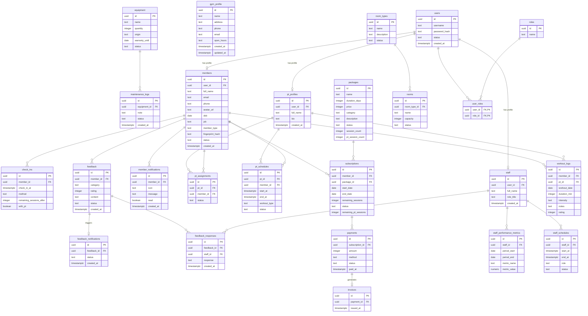

# Sơ đồ Cơ sở Dữ liệu Vật lý thực tế (Live Database Schema) - Gym Management System

Tài liệu này trình bày **Sơ đồ Cơ sở Dữ liệu Vật lý thực tế (Live Database Schema)** của hệ thống, được trích xuất và ánh xạ tự động từ cơ sở dữ liệu Postgres (Supabase) đang hoạt động thực tế của project.

Sơ đồ sử dụng ký pháp **Crow's Foot** biểu diễn toàn bộ cấu trúc 25 bảng thực tế hiện có trong database, chi tiết các trường, kiểu dữ liệu, các ràng buộc khóa chính (PK) và khóa ngoại (FK).

---

## 1. Sơ đồ Quan hệ Thực thể Vật lý thực tế (ERD)

---

## 2. Thống Kê và Mô Tả Chi Tiết 25 Bảng dữ liệu thực tế

| Tên Bảng (Table) | Chức năng chi tiết trong hệ thống | Danh sách các cột thuộc tính |
| :--- | :--- | :--- |
| **users** | Tài khoản đăng nhập hệ thống của tất cả các đối tượng. | `id`, `username`, `password_hash`, `status`, `created_at` |
| **roles** | Danh mục vai trò quyền hạn (Owner, Staff, PT, Member). | `id`, `name` |
| **user_roles** | Bảng trung gian liên kết tài khoản với vai trò (N-N). | `user_id`, `role_id` |
| **members** | Thông tin hồ sơ hội viên phòng tập. | `id`, `user_id`, `full_name`, `email`, `phone`, `avatar_url`, `dob`, `job`, `member_type`, `fingerprint_hash`, `status`, `created_at` |
| **staff** | Hồ sơ nhân viên vận hành, tiếp tân, quản lý phòng gym. | `id`, `user_id`, `full_name`, `role_title`, `created_at` |
| **pt_profiles** | Hồ sơ huấn luyện viên cá nhân (PT). | `id`, `user_id`, `full_name`, `bio`, `created_at` |
| **room_types** | Phân loại các khu vực phòng tập (Gym, Yoga, Zumba,...). | `id`, `name`, `description`, `status` |
| **rooms** | Phòng tập vật lý cụ thể. | `id`, `room_type_id`, `name`, `capacity`, `status` |
| **equipment** | Thông tin trang thiết bị máy móc phòng tập. | `id`, `name`, `quantity`, `origin`, `warranty_until`, `status` |
| **maintenance_logs** | Lịch sử bảo trì sửa chữa máy móc thiết bị phòng gym. | `id`, `equipment_id`, `note`, `status`, `created_at` |
| **packages** | Định nghĩa các gói tập luyện có sẵn phòng tập cung cấp. | `id`, `name`, `duration_days`, `price`, `category`, `description`, `status`, `session_count`, `pt_session_count` |
| **subscriptions** | Thông tin đăng ký gói tập và số buổi còn lại của hội viên. | `id`, `member_id`, `package_id`, `start_date`, `end_date`, `remaining_sessions`, `status`, `remaining_pt_sessions` |
| **payments** | Các đợt giao dịch thanh toán gói tập. | `id`, `subscription_id`, `amount`, `method`, `status`, `paid_at` |
| **invoices** | Hóa đơn giá trị giao dịch thanh toán. | `id`, `payment_id`, `issued_at` |
| **check_ins** | Lịch sử điểm danh ra vào phòng tập của hội viên. | `id`, `member_id`, `check_in_at`, `method`, `remaining_sessions_after`, `with_pt` |
| **staff_schedules** | Lịch làm việc ca kíp của nhân viên. | `id`, `staff_id`, `start_at`, `end_at`, `role`, `status` |
| **staff_performance_metrics** | Chỉ số đánh giá năng lực nhân viên theo kỳ. | `id`, `staff_id`, `period_start`, `period_end`, `metric_name`, `metric_value` |
| **pt_assignments** | Phân công PT hỗ trợ hội viên. | `id`, `pt_id`, `member_id`, `status` |
| **pt_schedules** | Lịch hẹn tập luyện chi tiết giữa PT và hội viên. | `id`, `pt_id`, `member_id`, `start_at`, `end_at`, `workout_type`, `status` |
| **workout_logs** | Nhật ký ghi nhận tiến trình và đánh giá buổi tập của hội viên. | `id`, `member_id`, `pt_id`, `workout_date`, `duration_min`, `intensity`, `notes`, `rating` |
| **feedback** | Đóng góp ý kiến của hội viên gửi lên hệ thống. | `id`, `member_id`, `category`, `rating`, `content`, `status`, `created_at` |
| **feedback_notifications** | Thông báo nhắc việc xử lý ý kiến phản hồi cho bộ phận Staff. | `id`, `feedback_id`, `status`, `created_at` |
| **feedback_responses** | Nội dung phản hồi góp ý được tạo bởi Staff cho Member. | `id`, `feedback_id`, `staff_id`, `response`, `created_at` |
| **member_notifications** | Hệ thống thông báo đẩy đến tài khoản hội viên. | `id`, `member_id`, `icon`, `message`, `read`, `created_at` |
| **gym_profile** | Thông tin cấu hình chi nhánh phòng gym (địa chỉ, hotline, giờ mở cửa). | `id`, `name`, `address`, `phone`, `email`, `open_hours`, `created_at`, `updated_at` |
