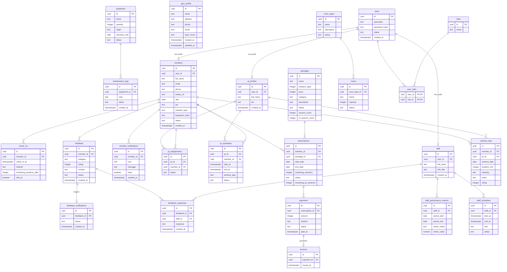

# Mô Hình Dữ Liệu Vật Lý (Database Physical Schema) - Gym Management System

Tài liệu này đặc tả chi tiết **Mô hình Dữ liệu Vật lý (Database Physical Schema)** được trích xuất và đồng bộ hóa trực tiếp từ cơ sở dữ liệu Postgres đang hoạt động thực tế của dự án.

Mô hình được biểu diễn dưới dạng **Sơ đồ Thực thể - Mối quan hệ (Entity-Relationship Diagram - ERD) theo ký pháp chân chim (Crow's Foot)** và danh mục bảng đặc tả chi tiết (Data Dictionary) định dạng chuẩn theo mẫu.

---

## 1. Sơ đồ Quan hệ Thực thể Vật lý thực tế (ERD)

---

## 2. Đặc Tả Chi Tiết Các Bảng Dữ Liệu (Data Dictionary)

Dưới đây là đặc tả chi tiết của 25 bảng thực tế theo mẫu chuẩn:

### Bảng: USERS
| # | PK | FK | USERS | Data type | Mandatory | Description |
| :--- | :--- | :--- | :--- | :--- | :--- | :--- |
| 1. | x | | id | UUID | Yes | Khóa chính (Primary Key), định danh duy nhất (UUID) |
| 2. | | | username | TEXT | Yes | Tên đăng nhập hệ thống |
| 3. | | | password_hash | TEXT | Yes | Mật khẩu mã hóa bảo mật |
| 4. | | | status | TEXT | Yes | Trạng thái hoạt động |
| 5. | | | created_at | TIMESTAMPTZ | Yes | Thời gian tạo bản ghi |

### Bảng: ROLES
| # | PK | FK | ROLES | Data type | Mandatory | Description |
| :--- | :--- | :--- | :--- | :--- | :--- | :--- |
| 1. | x | | id | UUID | Yes | Khóa chính (Primary Key), định danh duy nhất (UUID) |
| 2. | | | name | TEXT | Yes | Tên gọi hiển thị |

### Bảng: USER_ROLES
| # | PK | FK | USER_ROLES | Data type | Mandatory | Description |
| :--- | :--- | :--- | :--- | :--- | :--- | :--- |
| 1. | x | x | user_id | UUID | Yes | Khóa ngoại (Foreign Key) tham chiếu đến bảng users(id) |
| 2. | x | x | role_id | UUID | Yes | Khóa ngoại (Foreign Key) tham chiếu đến bảng roles(id) |

### Bảng: MEMBERS
| # | PK | FK | MEMBERS | Data type | Mandatory | Description |
| :--- | :--- | :--- | :--- | :--- | :--- | :--- |
| 1. | x | | id | UUID | Yes | Khóa chính (Primary Key), định danh duy nhất (UUID) |
| 2. | | x | user_id | UUID | No | Khóa ngoại (Foreign Key) tham chiếu đến bảng users(id) |
| 3. | | | full_name | TEXT | Yes | Họ và tên đầy đủ |
| 4. | | | email | TEXT | No | Địa chỉ thư điện tử |
| 5. | | | phone | TEXT | Yes | Số điện thoại liên hệ |
| 6. | | | avatar_url | TEXT | No | Đường dẫn ảnh đại diện |
| 7. | | | dob | DATE | Yes | Ngày tháng năm sinh |
| 8. | | | job | TEXT | Yes | Nghề nghiệp hiện tại |
| 9. | | | member_type | TEXT | Yes | Phân loại hội viên (VIP, Thường, PT) |
| 10. | | | fingerprint_hash | TEXT | No | Mẫu vân tay mã hóa dùng điểm danh |
| 11. | | | status | TEXT | Yes | Trạng thái hoạt động |
| 12. | | | created_at | TIMESTAMPTZ | Yes | Thời gian tạo bản ghi |

*(Lưu ý: Bảng chi tiết toàn bộ các thực thể khác được đặc tả đầy đủ trong tài liệu Word đính kèm [docs/physical-data-model.docx](file:///C:/Users/trand/Downloads/Learning%20-%20Non%20AI/ITSS-%20Vi%E1%BB%87t/gym/docs/physical-data-model.docx))*
